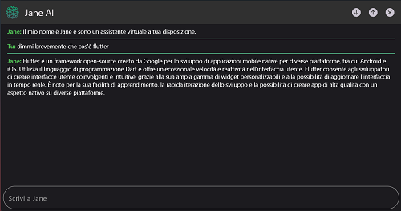
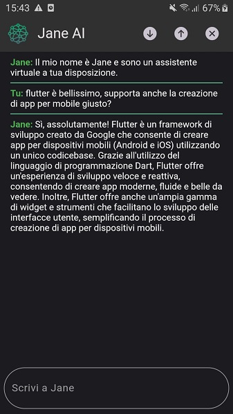
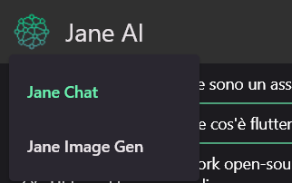
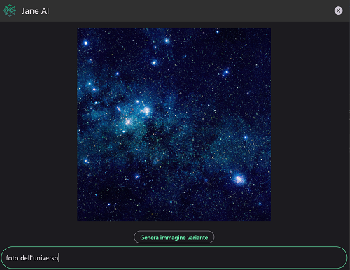

# ✨ Dart Jane

A little project based on the [dart_open_ai](https://pub.dev/packages/dart_openai) package.

This is a working open-source base. You can download it, improve it and distribute your project using this base. Or you may just want to take a look and have fun using ChatGPT in your Smartphone :)

The name of the chatbot is **Jane**, and by default she speak italian. You can of course change this behaviour by changing the initial setup on the <code>vars.dart</code> file. My fault, the entire App was built in Italian to show my mother the power of AI.. She doesen't speak english :')

Please take a look at the Getting Started section!

<hr>

# 💫 Getting Started

### What is Dart Jane?

Dart Jane uses the dart_open_ai package. It is a ChatGPT App!
<br/>
You can literally use ChatGPT in your Smartphone, but of course the official Open AI platform is way better in all its aspects.
Inside the source code you will find a working example on how to use the dart_open_ai package to send requests and receive a response. You'll find also a working Image generator!

### 🟢 How to use this project

In order to compile and run this project on your machine you need a complete flutter environment. You'll need the [Dart SDK](https://dart.dev/get-dart), [Flutter SDK](https://docs.flutter.dev/get-started/install) and the additional requirements listed on the install page.

Be sure to run the <code>flutter doctor</code> command to get informations about your flutter environment. When everything is fine you can open the project with VSCode or Android Studio.

In case you're going to use VSCode, you need the Dart and Flutter official extensions to make it able to run and debug any flutter project.

You need to insert your Open AI API Key as value of the variable <code>static String apiKey</code> in the `vars.dart` file, otherwise you'll be stuck at the loading screen and you will just face an error. You can't use the Open AI API without an API Key.
<br/>
<br/>
So, inside the vars.dart file you will find:

```dart
static String apiKey = "your_api_key";
```

You can get yours for free at [platform.openai.com](https://platform.openai.com) by registering an account and then requesting an API Key from your account settings.

<hr>

I've tested this project on Windows and on a Samsung Galaxy J5. Unfortunately a Mac is needed to install an App on an iPhone, and i haven't a Mac.

<br/>
<br/>

<p align="center">
    
</p>
<hr>
<p align="center">
    
</p>
<hr>
<p align="center">
    
</p>
<hr>
<p align="center">
    
</p>
